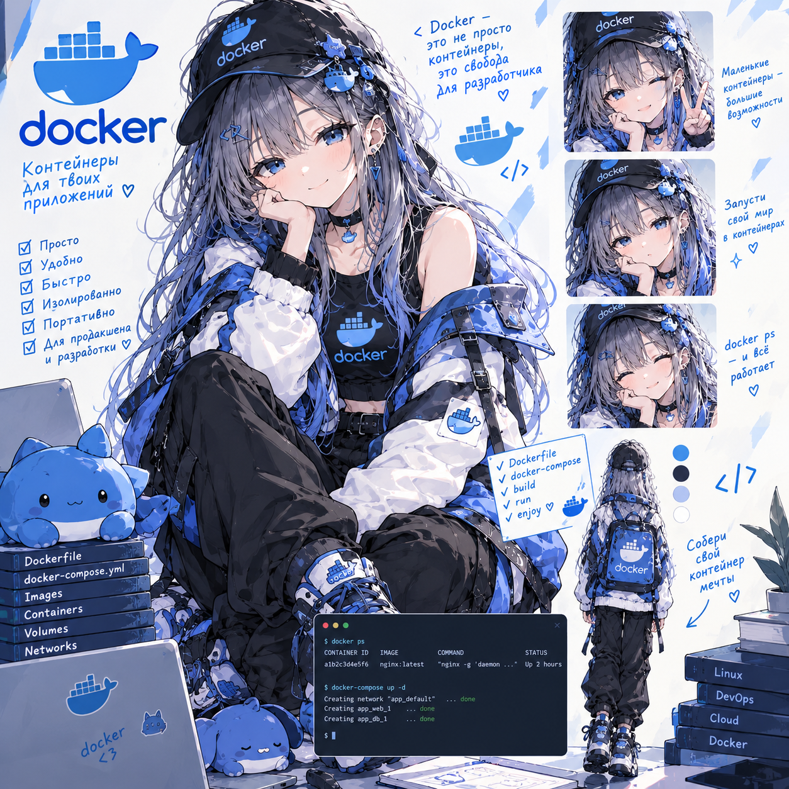

# Docker + Bash Lab — крепкое владение с нуля

**Статус: ⚪ методичка готова, прохождение впереди.**
**Сложность: базовая по входу, но объёмная.** Не требует предыдущих лаб — рассчитана на полных новичков в контейнерах; Bash даётся параллельно, ровно в том объёме, который нужен для entrypoint-скриптов.

## О чём

Docker и Bash разобраны подробно и с нуля — то, на что в [Traefik Lab](https://github.com/meeymirita/traefik-lab) был выделен всего один вводный раздел. Здесь нет reverse proxy и multi-service архитектуры ради архитектуры — только сам Docker (образы, контейнеры, Dockerfile, тома, сети, Compose) и Bash как параллельный трек, потому что почти каждый Dockerfile и entrypoint-скрипт в реальных проектах написан именно на нём.

## Стек

Node.js (Express) + PostgreSQL, всё в Docker / Docker Compose. Устанавливать заранее ничего не нужно, кроме самого Docker — остальное даётся по ходу лабы.

## Формат

Методичка [`Docker_Bash_Lab.html`](Docker_Bash_Lab.html) — открывается в браузере, прогресс по чекбоксам сохраняется локально.

## Что внутри

- **Разбор с нуля** — проблема, которую решает Docker; чем контейнер отличается от виртуальной машины; образ vs контейнер vs Dockerfile vs registry; жизненный цикл контейнера и команды на каждый день; restart policy
- **Образы и Dockerfile** — анатомия Dockerfile, слои и кэш сборки под капотом, build context и `.dockerignore`, `COPY` vs `ADD`, multi-stage build, `alpine` vs `slim` vs `distroless`
- **Bash параллельным треком** — shebang, переменные, условия, циклы и функции, позиционные параметры, `set -e -u -o pipefail`
- **ENTRYPOINT vs CMD** — shell form vs exec form, как аргументы `CMD` попадают в entrypoint-скрипт
- **Тома и данные, сети** — проблема, которую решают volumes, несовпадение UID/GID, драйверы сети, своя bridge-сеть и DNS между контейнерами, `EXPOSE` vs `-p`
- **Docker Compose** — анатомия `docker-compose.yml`, `depends_on` + healthcheck («запущен» ≠ «готов принимать соединения»), `environment` vs `env_file` vs `.env`

## Пошаговая сборка проекта (3 сессии)

Проект нарочно простой — маленькое Node.js-приложение и PostgreSQL, вся сложность сосредоточена в Docker и bash, а не в бизнес-логике:

- **Сессия 1** — первый образ и первый bash-entrypoint: `Dockerfile` → `.dockerignore` → `entrypoint.sh` → отладка
- **Сессия 2** — данные, сеть и ожидание готовности сервиса: PostgreSQL → своя сеть → wait-for-скрипт → сигналы → multi-stage
- **Сессия 3** — Compose и Production Hell: всё вместе → `.env` → restart policies → отладка без подсказок

В конце методички — явная точка возврата к Traefik Lab с указанием, какие термины оттуда теперь понятны без пояснений.

---

Часть сборного репозитория лабораторных работ — [submodule-group-lab](https://github.com/meeymirita/submodule-group-lab).
